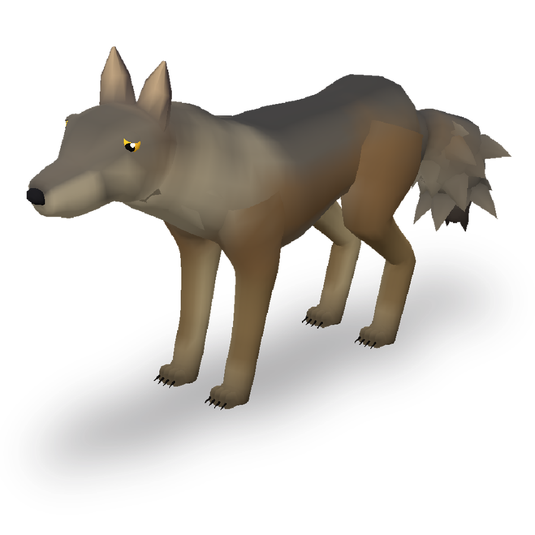
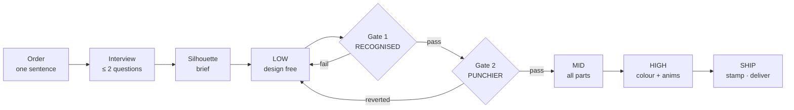
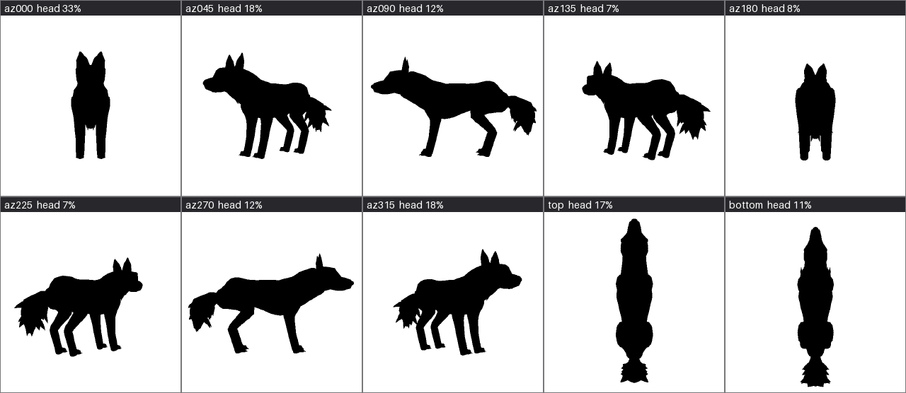

<div align="center">

# anyCreature

**Text → a game-ready 3D creature, in one session.**

An AI session takes an order like *"make me a menacing mountain giant"*, asks at most
two questions, and delivers a skinned, animated, vertex-coloured, AO-baked GLB plus an
offline showroom viewer.

[](LICENSE)
[](CHANGELOG.md)
[](engine)
[](https://www.khronos.org/gltf/)
[](setup.sh)




</div>

*Every creature is compiled from one JSON spec. No mesh files, no downloaded art
packs, no photogrammetry. The worked example that ships with this repo,
[`example/wolf.json`](example/wolf.json), is 5,752 vertices and 32 joints written
out by the engine from plain text.*

---

## Quick start

```bash
bash setup.sh                              # deps + red/green ruler calibration
node engine/cli.js example/wolf.json out/wolf.glb
```

`setup.sh` must print **`calibrate OK`** before you trust anything else: it builds one
spec that has to pass and two that have to be blocked — each for its own named fault —
and checks the colour ruler tells the example from a greyed copy of it, so you know the
rulers separate good from bad on your machine (`harness/calibrate.py`). Any failure
exits non-zero. `bash tools/test.sh` runs the whole self-check suite, the same one CI runs.

To run the full text-to-creature session, give your agent (Claude Code,
Cursor, a VM agent — anything that runs shell commands) EXACTLY this:

> Read MANUAL.md in this folder and follow it exactly — the cards in cards/
> are the pipeline, do not improvise around them. First run `bash setup.sh`
> and confirm it prints "calibrate OK". Then make me: **\<describe your
> creature\>**. Real-world height: **\<e.g. 1.8 m\>**.
> Ask me exactly one question — card 01's — and nothing else. Not cost, not
> token budget, not how long, not whether to publish. Decide the rest and
> tell me what you chose when you deliver.

Three things that make or break the result:

- **Don't invent your own workflow prompt.** "Use this workspace to generate a
  character" skips every quality gate in the pipeline; twenty iterations of
  that will not equal one pass through the cards.
- **Let the agent run `setup.sh` itself, in its own environment.** Don't
  pre-bundle `node_modules` into a zip — dependencies are per-machine.
- **Image reference?** The pipeline is text-first. Tell the agent: *"extract a
  one-paragraph creature brief from this image — masses, signature parts,
  proportions, real-world size — then proceed with the cards."* The image
  becomes the brief; the pipeline does the rest.

### Driving it harder

| Knob | Where | What it changes |
|---|---|---|
| `smooth_angle` | spec root, or per volume/part | Crease threshold in degrees, default `50`. Higher = smoother body, lower = more facets. |
| `shading` | spec root | Whole-body vertical colour ramp and grain — `{gradient:{top,bottom}, noise:{size,amount}}`. |
| `build: "rigid"` | spec root | The only way to get a fully faceted body past the checker. For robots and crystals, not for animals. |
| `ao` | spec root | Per-vertex ambient occlusion; `false` to skip the bake. |
| `embed_spec` | spec root | Every GLB embeds its own authored spec (`asset.extras.source_spec`) + a parts manifest — any agent can extract, edit, recompile, or **graft parts between creatures** (`harness/graft.py`). `false` opts out. |
| `harness/claims.json` | QC | The one claims sheet — signature presence, 6:3:1 hierarchy, focal contrast, saturated area, rig/animations, triangle budget. Everything is judged at boss standard; adjust `tri_budget` for cheap creatures. |

## What is actually in here

| Folder | What it holds |
|---|---|
| `engine/` | The ACS engine. One JSON spec in, one skinned GLB out. Zero runtime dependencies — `node engine/cli.js spec.json out.glb` is the whole interface. |
| `cards/` | The five stage cards the executing session reads, plus the spec syntax on one page. |
| `harness/` | Measuring tools (silhouettes, layout and colour measures, claims judge), the round/brief/identity helpers, calibration, the delivery packer and the publisher. |
| `example/` | A bred, approved light quadruped to read and copy from. |
| `calibration/` | One sample that must build and two that must be blocked — proof the rulers separate good from bad. |

## How it works



### The two gates

Neither gate is self-graded. The session that designed the creature is the worst
possible judge of whether it reads, because it already knows what it drew. So the
silhouettes go to a **context-free reader agent** that has never seen the order, and
the only question is *"what is this?"*

Gate 1 is **RECOGNISED**, read on the orbit: the reader gets six silhouettes in one
batch — the face, both obliques, the profile, the tail and the top — and the creature
has to be named across enough of them, **including an in-between view and the view the
brief declared**. A creature that reads only from the front and the side is a creature
built for two cameras. Gate 2 is **PUNCHIER**: a new
round may only make the silhouette bolder than the last one — a round that tames the
shape is reverted, even if it is "more correct". LOW's deliverable is an exaggerated
silhouette, not an accurate one.

### The engine floors

The compiler talks in three registers, and they mean different things:

| Prefix | Meaning |
|---|---|
| `BLOCK:` | The build stops. A hard floor was crossed — faceted body, part floating off its host, a mirrored twin distorted past 30%, an attack that never reaches. |
| `warn:` | It built, but something is probably wrong. Read it. |
| `info:` | A number you asked for, or an assumption the compiler made on your behalf — like which way an anchored fin ended up facing. |

Floors are not style opinions. They are the failures that survive review and ship
broken: a body that renders in hard facets, a horn that hovers a centimetre off the
skull, a right thigh collapsed to 40% depth by mirrored skinning.

### What gets measured



Every round projects an **8+2 orbit** from the vertices — eight horizontal views 45°
apart, like a cylinder around the creature (az000 looks at its face, az090 at its left
flank), plus top and bottom — reduces them to masks, and computes the numbers the design
card declared a target for: width over height, mass thirds, protrusions, thinnest feature,
convexity, and IoU against the previous round as a regression guard. Which way is "the
face" comes from the skin: the head is every vertex bound to the spec's head joint and
below it, not the longest side of the bounding box.

Two things are measured that four views never saw. **The head, per view** — how much of
the silhouette it owns, and how much of its outline clears the body (a skull sunk between
the shoulders owns pixels and no outline). **The in-between angles** — each azimuth is
compared with its two neighbours, and one that closes into a lump they do not is flagged.
Both are advice, printed with the round and drawn on `orbit_sheet.png` (colour, all ten
views) and `orbit_sil_sheet.png` (the silhouettes above). The 48px thumbnail is what the
blind reader actually sees; if it does not read at 48px, it does not read.

## The doctrine in one paragraph

Head-to-head experiments showed the model designs BOLDLY when left free, and
every attempt to teach it design upfront made the output tamer — so this harness
ships a **clean painter and a strict inspector**. The creation side gets only the
order, the engine syntax, and a short pit-map of engine-local traps; ALL quality
control lives in gates read by context-free reader agents, never self-graded.
Form beats obedience, everywhere.

## Honesty about limits

- **Isolated-part blind reads misfire on dome-plus-hanging-tube heads.** Elephants and
  birds get read as something else when the head is shown alone; put the same head back
  on the body and it reads fine. Trust the whole-body read when the two disagree.
- **The budgets are calibrated on the heaviest class of creature only.** A simpler one
  should cost less, but nothing lighter has been calibrated — treat the triangle budget
  in `harness/claims.json` as an estimate rather than data.
- **Splitting the modelling across subagents costs more, not less.** Same creature,
  same green build, measured both ways: one agent start-to-finish against four
  short-lived agents in a chain (skeleton → parts → anims → verify). The chain was
  worse on every axis. Onboarding was not the cause — every fresh agent read the
  same ground truth, a small fraction of either bill — the cause was re-derivation:
  work the previous agent had already done and could not hand over. Iron law 9 in
  card 00 states the rule; this is the measurement behind it. Two repetitions per arm, all four builds passed, so
  this fixes the direction and not the distribution.
- **`part_attachment` and `mirror_distortion` are new in 1.2.0.** Specs authored against
  an older version may now be blocked. That is usually the checker being right, but it
  is a breaking change, not a silent improvement.
- **The example wolf is a SYNTAX reference, never a starting skeleton.** It ships the
  three clips card 03 asks for (idle, move, attack), but the engine
  refuses a build whose joints are the example's with the numbers barely moved
  (`example_copy`), because a thin order is not permission to ship a recoloured
  wolf. Read it for syntax.
- **The engine has zero dependencies; the tooling needs numpy, pillow and scipy.**
  Nothing here launches a browser: as of 1.3.2 every silhouette, share, colour number
  and even the hero shot is computed from the vertices. scipy is the one that matters —
  without it the legibility and boldness measures do not compute, and a gate with
  nothing to read passes everything.

## Scripts

| Script | Role |
|---|---|
| `engine/cli.js` | Spec → GLB. The whole engine interface. |
| `harness/outline.py` | THE measuring tool. The 8+2 orbit (eight azimuths, top, bottom): silhouettes, thumbnails, a colour render per view and the two orbit contact sheets; layout and boldness measures, the head per view, per-part shares, colour, and `hero.png` — all projected from the vertices. |
| `harness/judge.mjs` | Claims judge over those numbers — part shares, focal contrast, saturated area, orbit consistency and the head (advice), rig/anim/triangle budgets. |
| `harness/deliver.py` | Stamps identity into the GLB, writes the offline showroom viewer, `hero.png` and the orbit sheets, builds the upload pack. |
| `harness/calibrate.py` | The red/green ruler calibration `setup.sh` runs. |
| `tools/test.sh` | The whole self-check suite: sync check, calibration, every harness tool on the example. CI runs exactly this. |
| `harness/publish.mjs` | Gobkit publisher. Only runs after an explicit yes, and always tries the upload before offering the manual page. |

## Requirements

Node 18+ and Python 3.9+. Windows: run `setup.ps1` in PowerShell (or `setup.sh` in Git Bash/WSL). `setup.sh` installs `three`, `numpy`, `pillow` and `scipy`,
then builds the shipped example end to end and runs the red/green calibration. No browser is installed
or launched. The engine alone needs nothing but Node; the dependencies are for the
measuring tools and the offline viewer.

## Output contract

Every GLB this harness writes satisfies [`docs/OUTPUT_CONTRACT.md`](docs/OUTPUT_CONTRACT.md)
— two chunks, no trailing bytes, no external URIs, no textures (colour is baked
into vertex colours), semantic material names, convention bone names. Verify any
file with `node harness/glbcheck.mjs <file.glb>`; the same module runs as a
dependency-free import inside a server or Worker.

## Security

Nothing in this package opens a socket or launches a browser: as of 1.3.2 every
measurement is arithmetic on the vertices. The only network call is `publish.mjs`,
and only after the user's explicit yes. The Gobkit submission key in
`harness/gobkit.json` is **public by design** — it authorises posting to the community
wall and nothing else. Details and reporting: [`SECURITY.md`](SECURITY.md).

## Licence

MIT — see [`LICENSE`](LICENSE). One third-party component is bundled
(`harness/assets/three-bundle.js`, three.js, MIT); attributions for it and for
everything `setup.sh` installs are in
[`THIRD-PARTY-NOTICES.md`](THIRD-PARTY-NOTICES.md).

---

## About

**Gobkit: AI-native 3D infrastructure for agents and vibe coders.** Stream
game-ready 3D assets straight into your workflows via API. Agent-friendly.
Studio-quality. Built by a team of artists and engineers.

**Author:** Ariescar | Alsomindtech

👹 [gobkit.com](https://gobkit.com) · 📖 [Devlog](https://gobkit.com/harness/anycreature)
