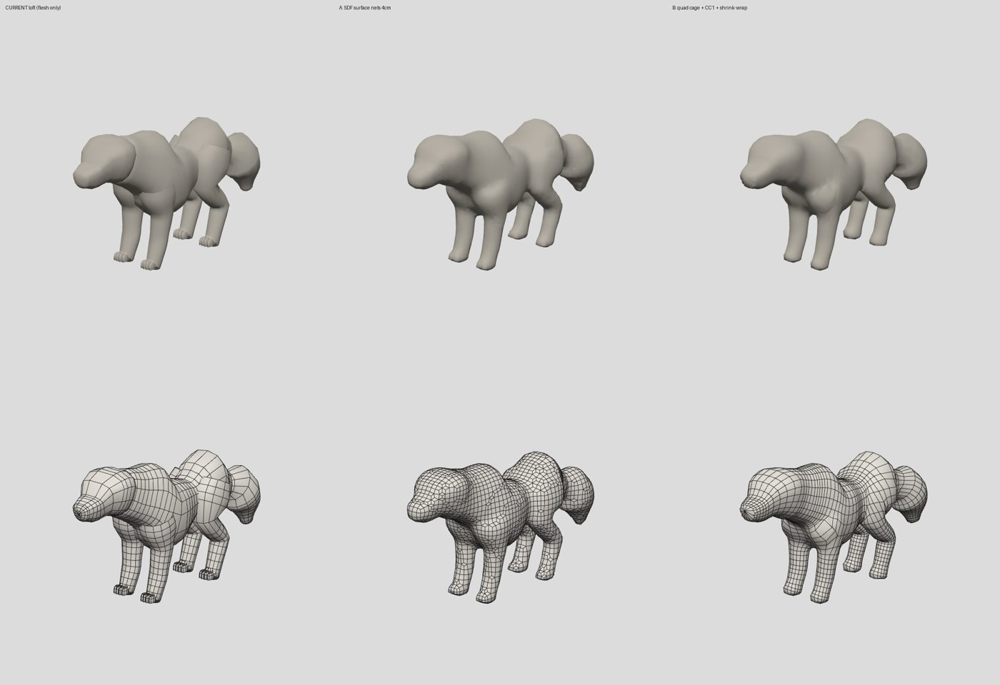
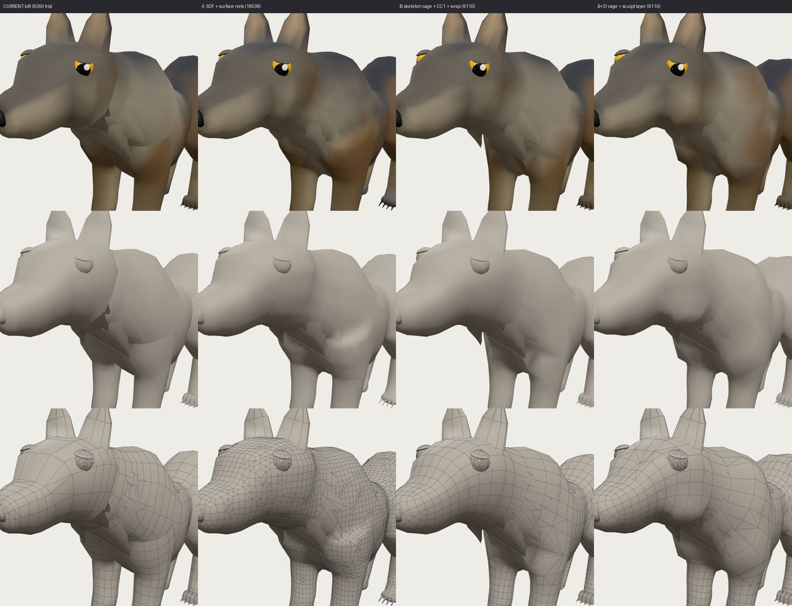
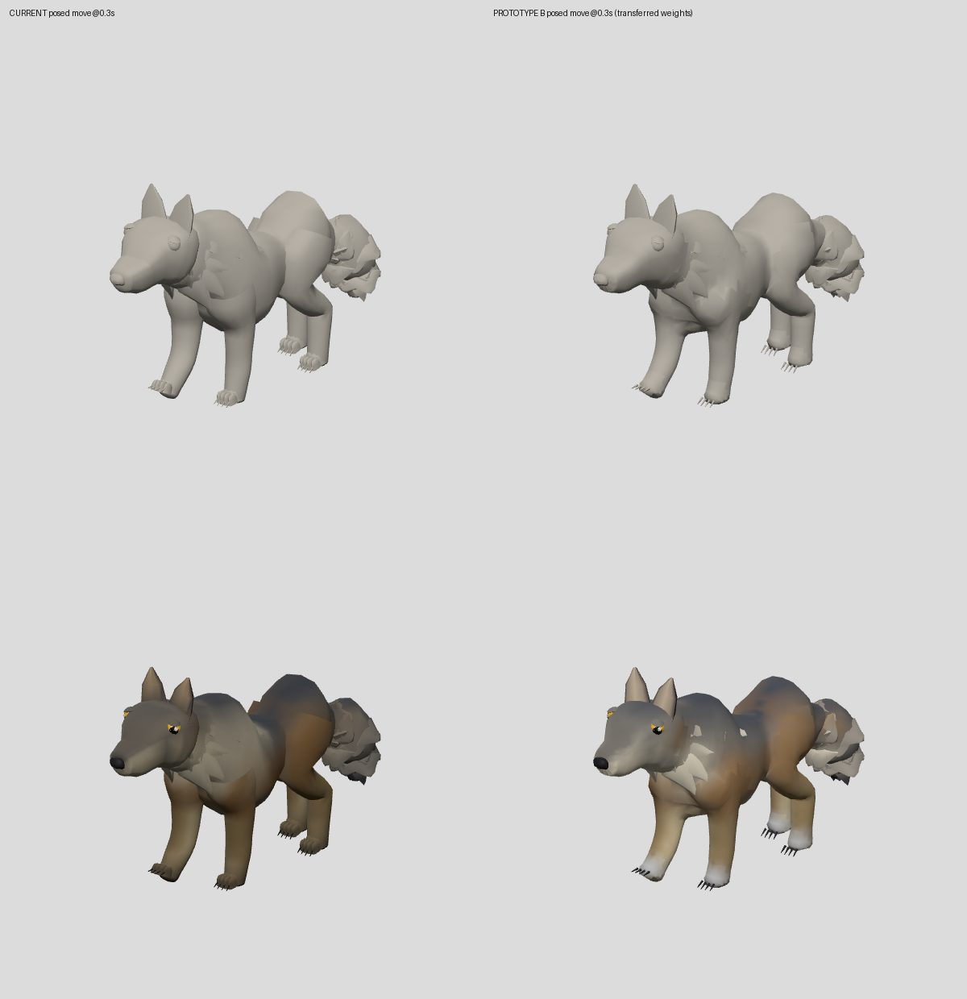
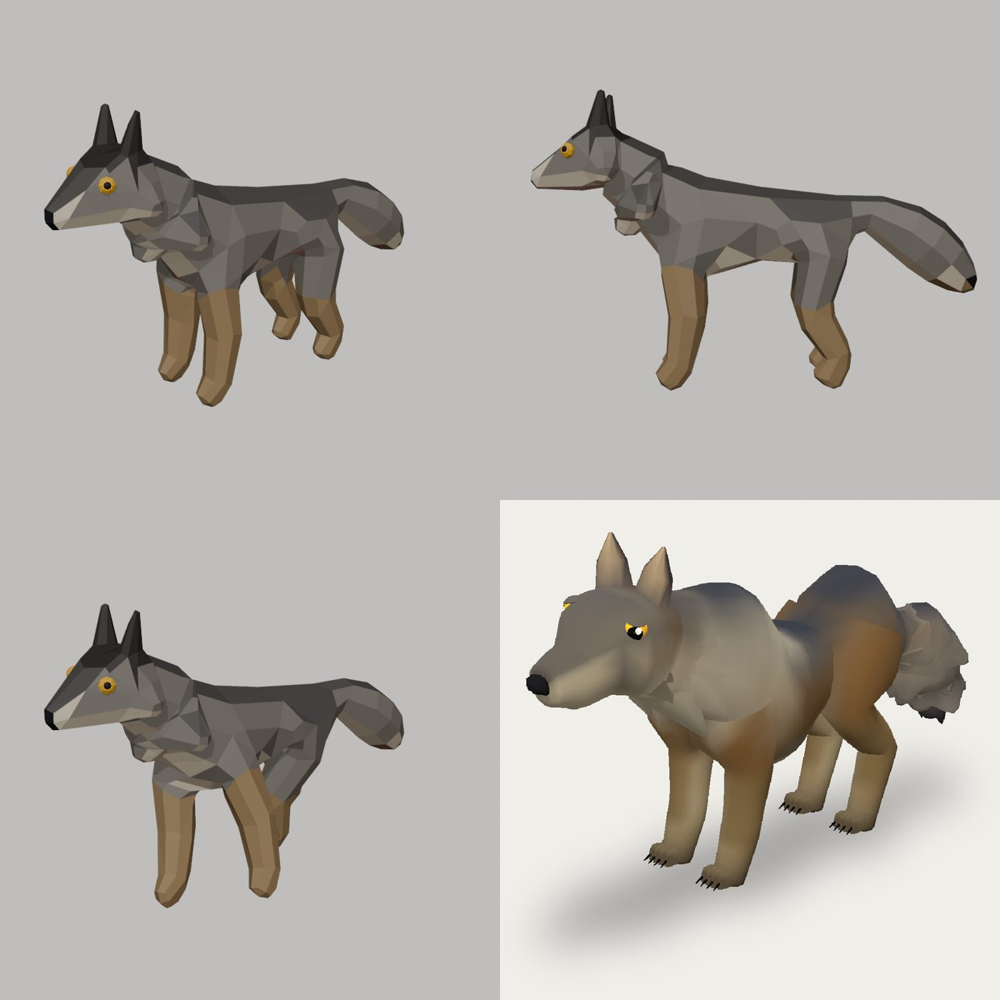
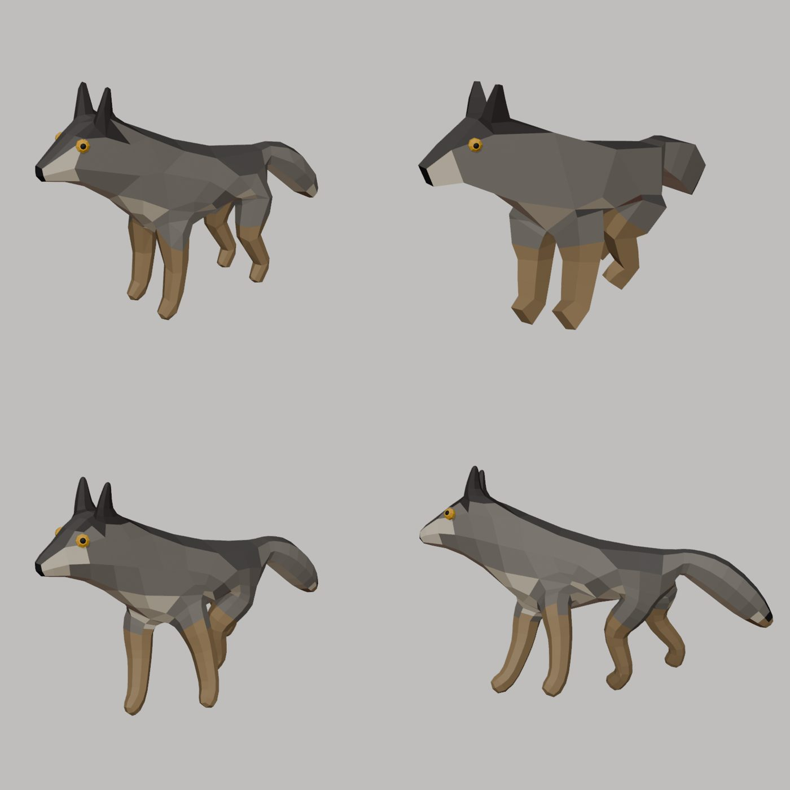
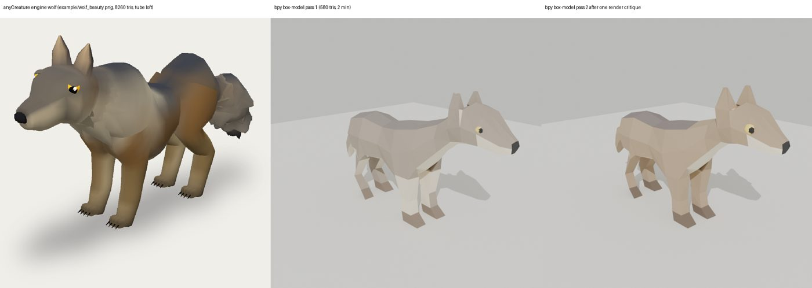
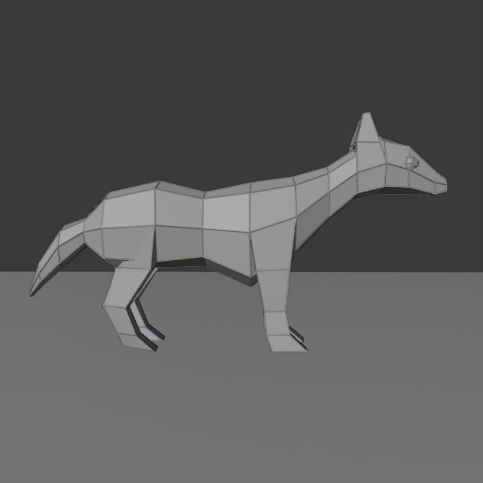

# Research: why the creatures read as tubes, and what to do about it

Two independent investigations, each run once by a Fable 5.1 agent and once by an
Opus 5.5 agent that did not see the other's work. Nothing here changes the engine
yet — it is the evidence for the next direction.

## 1. Surface review (why the loft looks procedural)

Full Fable report: [`2026-09_surface_review_fable.md`](2026-09_surface_review_fable.md).
Both reviews measured the same causes:

- Every chain is its own closed tube rammed into its neighbours (wolf: 34 shells,
  a quarter to a third of all triangles hidden inside other volumes). Junction
  normals, junction skin and the L1 seam blend only hide seams the geometry
  still has; posed, they come back.
- Perfectly regular topology: constant sides, uniform ring spacing, one
  symmetric superellipse per row, no poles, no edge flow following anatomy.
- No secondary forms (scapula, elbow point, brow, cheek, jaw plane), and the L8
  bone-field normal pulls every flesh normal 30% toward a cylinder.
- Bolted-on parts (paws, eyes, ears, identical tufts), each a separate shell.

Every spec knob is a parameter of a tube, which is why seven tuning passes
changed proportions but not the kind of surface.

Prototypes on the wolf (both reviews independently converged):

| variant | total tris | result |
|---|---|---|
| current loft | 8,260 | seams at every junction |
| SDF smooth-union → surface nets | 10–18.5k | seam-free but voxel-looking, over budget |
| skeleton quad cage → Catmull–Clark ×1 → shrink-wrap onto SDF | 8,710–9,110 | one continuous surface, ~97% quads, loops round shoulders/hips; poses cleanly |
| same + sculpt layer | 9,110 | head flows into neck; brow, stop, cheek, jaw plane appear |

## 2. How humans model low-poly creatures, and what works with LLMs (Opus)

- Human order of work: concept → silhouette → one connected blockout (box
  modelling, or Blender's Skin modifier from a stick figure with radii) → edge
  loops only where things bend → flat, region-coloured faces → auto weights from
  the same skeleton, then fixes. Fine forms go into colour, not geometry.
- Budgets: PS1 250–750 tris; stylised game assets roughly 300–8k. Ours ~8–9k.
- The hand-made look comes mostly from low polygon count, flat facets and one
  connected surface, not from clever topology. Ours sits in between: too smooth
  to read as low-poly, too tubular to read as sculpted.
- LLM literature (2024–2026): LLMs writing modelling code works, but they are
  unreliable with exact coupled numbers and good at structure and relations —
  design languages should be relational with a plan → build → critic loop, and
  visual critique works best as pairwise A/B, never absolute grading.
  Mesh-token models and image-to-3D are not usable here (face caps, no weights,
  GPU-only, dense generic output).
- Headless Blender 5.0.1 (`pip install bpy`, plus `tbb` and Mesa EGL libs) runs
  in this container, including Skin modifier, subdivision, decimate, heat
  weights and animated GLB export.

Proof: [`proto/wolf_skin_blender.py`](proto/wolf_skin_blender.py) — a 29-point
stick graph with radii → Skin modifier → five soft-brush edits → flat
region colours → armature from the same graph with heat weights → a trot,
exported to GLB. 388–1,600 tris, 10–20 s per iteration, 3 iterations. Reads
immediately as a low-poly game wolf; plainer than ours (no paws, claws, lids,
brow), stiffer proportions, lumpy ruff.

Workflow notes from the same research: keep the blind identity readers, the
brief, the one question and the orbit; add a blind pairwise "which looks like a
hand-made game asset?" read against a CC0 hand-made reference, because nothing
currently measures craft; many engine rules exist only to police loft
artefacts; the triangle target should drop to roughly 0.4–3k for this style.

## 3. The same question, researched independently (Fable)

Full report with citations: [`2026-09_modelling_research_fable.md`](2026-09_modelling_research_fable.md).
It reached the same verdict from the other side:

- The human low-poly sequence (Synty / Quaternius / PS1 style): reference
  sheet → cube + mirror (clipping) → extrude the big masses, a ring only where
  the form changes → legs, ears and tail **extruded out of torso faces** (shared
  vertices, no intersecting shells) → flat shade → break symmetry by hand →
  4–8 flat colours → armature + automatic weights. 300–3000 tris, 3–4× denser
  on head and hands than thigh.
- Blender's Skin modifier (skeleton + per-vertex radius → surface) is
  essentially anyCreature's representation, and every tutorial calls it a base
  mesh to sculpt or hand-edit, never the final low-poly: "there is no
  substitute for placing the polys". The engine ships the base mesh.
- Code agents succeed with typed parts and machine-checked joins, a real
  renderer plus VLM critic, and one diagnosed fix per round. VLM judges must be
  asked in both orders to cancel position bias. LLMs get magnitudes roughly
  right and directions (left/right/depth) wrong.
- Workflow: keep the one question, the brief, the 48 px blind reads with
  canary/shuffle, the orbit, the restart rule, one agent, state on disk and the
  output contract — `outline.py` and `glbcheck.mjs` accepted a Blender GLB
  unchanged, so the harness is engine-agnostic. Change the representation to
  skeleton + box-modelling verbs, the target to flat low poly 500–3000 tris,
  and let the modeller look at its own renders every build (self-grading stays
  banned). Drop the loft-policing checks.

Proof: [`proto/wolf_boxmodel_blender.py`](proto/wolf_boxmodel_blender.py) — a
bpy box-model program (mirror, extrude, loop cuts, flat shade, vertex colour,
auto weights, idle clip): 580 tris, 25 bones, passes `glbcheck.mjs` and the
orbit. Two passes, one render critique between them, ~80 s each. Reads at once
as a person-made low-poly wolf; still a junior first pass (thin hind legs, low
tail root, sphere eyes, no mouth or claws).

## Where the two converge

Both independent investigations rank the same approach first: the LLM writes
a **box-modelling program** (headless Blender works in this container) —
one connected, mirrored, flat-shaded, region-coloured surface of roughly
0.5–3k triangles, rigged with automatic weights from the skeleton it placed —
driven by a render → critique → one-fix loop, with the existing harness
(orbit, blind identity reads, output contract) kept as the judge, plus a new
blind pairwise "which was made by a person?" read.
