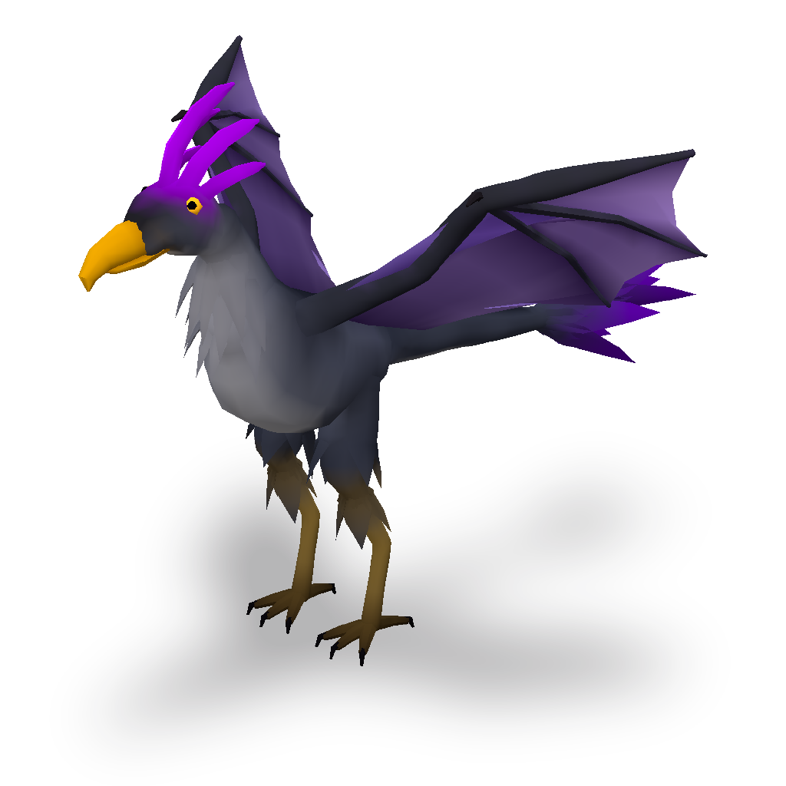

# Gallery: creatures that are not the wolf

`example/wolf.json` is one light quadruped. The creatures here exist to show that
the same engine builds a different body plan, and `tools/test.sh` rebuilds each
spec in this folder on every run and fails on any `BLOCK`. Like the wolf, they
are syntax references. Don't use them as a starting skeleton: `example_copy`
only guards the wolf and the calibration samples, so nothing will stop you, but
the design cards ask for a skeleton built from your own brief.

## raven_wyvern: a crested raven-wyvern



A bipedal wyvern with a raven's head. Its forelimbs are membrane wings, raised
in a swept-back mantle. It has a heavy hooked bill with a hinged lower mandible,
a fan of violet crest blades, a pale shaggy throat bib, feathered thighs over
scaled shanks, and four-toed talons with hooked claws (three toes forward and a
hallux back). A long whip tail ends in a violet feather fan.

| | |
|---|---|
| build | 45 joints, 6,636 vertices, 8,564 triangles (claims band 4,000-9,000), all green |
| clips | `idle` (breath, head tilt, wing settle), `move` (bipedal stride, balance flutter), `attack` (neck and wings wind back with the bill open, then the root lunges and the neck throws the bill forward) |
| declared | named parts, `function` (head = effector, legs and wings = locomotion; the toes and claws inherit the leg's), `joint_range` for every animated joint |
| colour | hero view saturated area 25.0%, median albedo luminance 65.3. Near-neutral slate masses with a dark saddle and a pale breast, dusky violet wings with a darker leading edge and rib veins, magenta crest and tail fan (the spotlight), gold bill, dark talons |

What it exercises that the wolf does not:

- **`membrane` wings, coloured.** Each wing has four ribs: the arm as the
  leading edge, two fingers, and a trail chain that brings the sheet back to
  the flank. The arm and the fingers are thin volumes, so the bones show
  through the skin, and the membrane's `colors` block (bands in the sheet's own
  u/t frame plus `veins`) darkens the leading edge, draws the ribs through the
  skin and pales the tip.
- **A part on a part.** Each foot is four `curve` toes on `LToe` in their own
  `talon` material; each claw is a `curve` seated on its toe with
  `"host_part": "toe_mid"` at 0.88 of the toe's length, pointing along it, its
  skin inherited from the toe. The earlier build needed a three-joint chain and
  a volume per toe (8 chains, 16 joints, 8 volumes) because a claw on a curve
  was refused as floating.
- **A loose joint** (`Jaw`, attached to `Skull`) that carries the lower bill, so
  the attack opens the beak.
- **`tufts` used as feathers**: the throat bib, the feathered thighs and the
  tail fan. **`curve` blades** make the crest.
- **A chain that ends inside the next mass.** The neck is domed into the head
  (`"caps": ["none", "dome"]`) and the head's root ring sits inside the neck.
  The `open_end` check exists because the first build had the neck open at the
  head end with 75% of that ring outside it.

Files: `raven_wyvern.json` (the spec), `raven_wyvern.glb` (built from it, skinned,
three clips, AO baked), `raven_wyvern.checks.json` (the engine's gate stamp),
`raven_wyvern_beauty.png` (the `outline.py --hero` shot) and
`raven_wyvern_silhouette.png` (side view).

Rebuild and measure:

```bash
node engine/cli.js example/gallery/raven_wyvern.json example/gallery/raven_wyvern.glb
python3 harness/outline.py example/gallery/raven_wyvern.glb out/rw --hero out/rw/hero.png
node harness/judge.mjs example/gallery/raven_wyvern.glb out/rw raven_wyvern
```

### Where the engine got in the way — and what the fourth pass did about it

The first build of this creature listed four engine limits. Each is now a
feature or a check, and the build above uses all of them:

- **A part could not host a part** — `part_seat` and `part_attachment` measured
  only against volumes, so a claw on a `curve` toe was refused as floating.
  Now: `host_part` (above). The toe chains are gone.
- **A membrane was one flat colour** — `colors.arcs` worked on volumes and
  curves but not on membranes. Now: membrane `colors` in the sheet's u/t frame
  plus `veins`.
- **An open volume end showed the background** and nothing checked. Now:
  `open_end` BLOCKs an open ring a third exposed, and warns at a tenth.
- **The junction seam returned during animation** — the normals copied from
  the host in bind pose rotated with the limb bone. Now: the skin weights blend
  across the junction band too, so the root moves with the body and the seam
  stays gone mid-clip (`shading.normals.junction_skin`).

What is still true:

- **With membrane wings, colour budget and spotlight pull against each other,
  and the ruler reads the shipped colour, not the palette.** The spread
  membrane is about 30% of the hero view on its own, and the shading stack
  raises HSV saturation in shadow by about 0.1 on mid-saturation surfaces (the
  wing's palette is S 0.41, under the 0.50 bar, yet 64% of its shipped vertices
  measure over it). A saturated membrane therefore lands at 48-55% saturated
  area, far over the card's 34% ceiling. The wings stay dusky violet and the
  vivid colour is on the crest and tail fan; the leading edge and veins are
  darker, not louder. See the CHANGELOG for the measurement — the ceiling was
  left where it is.

The build warns that `lower_bill` sits 63% inside `upper_bill`. That one is
real and intended: the closed bill halves overlap at rest, and the `Jaw` hinge
opens them in the attack.
