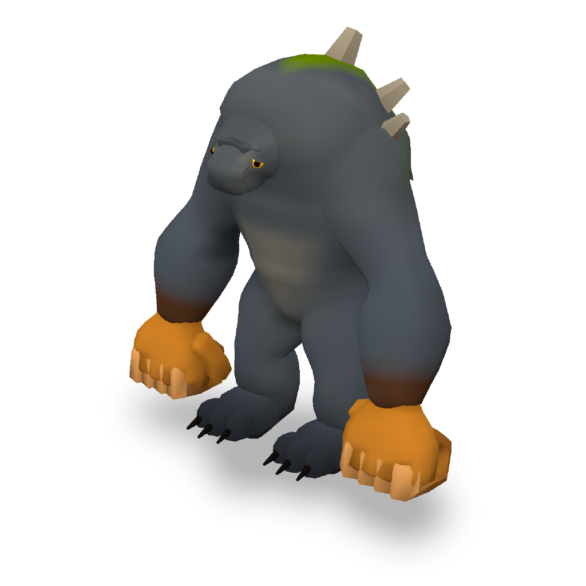

# Gallery: creatures that are not the wolf

`example/wolf.json` is one light quadruped. The creatures here exist to show that
the same engine builds a different body plan, and `tools/test.sh` rebuilds each
spec in this folder on every run and fails on any `BLOCK`. Like the wolf, they
are syntax references. Don't use them as a starting skeleton: `example_copy`
only guards the wolf and the calibration samples, so nothing will stop you, but
the design cards ask for a skeleton built from your own brief.

## raven_wyvern: a crested raven-wyvern


A bipedal wyvern with a raven's head, built to stylised-game proportions
(`cards/STYLE.md`): a big head on a short thick neck, a compact deep chest with a
keel, short sturdy legs with a real drumstick thigh, and a thick tail that
continues the body line. Its forelimbs are membrane wings folded back and down
at rest, wrists just above the shoulders and the tips sweeping back past the
tail root, so the membrane reads as a sail from the side and the back view is
a creature with folded wings, not a T. It has a heavy hooked bill with a hinged
lower mandible, a big gold eye under a dark brow ridge that dips toward the bill
(the expression), a fan of violet crest blades, a pale shaggy throat bib,
feathered thighs over scaled shanks, and four-toed talons with hooked claws
(three toes forward and a hallux back). The tail ends in a violet feather fan.

| | |
|---|---|
| build | 45 joints, 6,283 vertices, 7,690 triangles (claims band 4,000-9,000), all green; head share of the orbit 25 / 29 / 26 / 17 / 12 / 17 / 26 / 29% (az000-az315), top 35% |
| clips | `idle` (breath, head tilt, wing settle, and the stance: the left foot 11 cm ahead of the right, held by the hips with the ankles levelling the feet), `move` (bipedal stride, balance flutter; the rest pose is symmetric, so the two feet trace the same path half a cycle apart), `attack` (neck and wings wind back with the bill open, then the root lunges and the neck throws the bill forward) |
| declared | named parts, `function` (head = effector, legs and wings = locomotion; the toes and claws inherit the leg's), `joint_range` for every animated joint |
| colour | hero view, on the palette: 42.0% coloured (S ≥ 0.30), 18.6% loud (S ≥ 0.50); median shipped luminance 63. Near-neutral slate masses with a dark saddle and a pale breast, dusky violet wings with a darker leading edge and rib veins, magenta crest and tail fan (the spotlight), gold bill and eye, dark brow, dark talons |

What it exercises that the wolf does not:

- **`membrane` wings, coloured.** Each wing has four ribs: the arm as the
  leading edge, two fingers, and a trail chain that brings the sheet back to
  the flank. The arm and the fingers are thin volumes, so the bones show
  through the skin, and the membrane's `colors` block (bands in the sheet's own
  u/t frame plus `veins`) darkens the leading edge, draws the ribs through the
  skin and pales the tip.
- **A part on a part.** Each foot is four `curve` toes on `LToe` in their own
  `talon` material; each claw is a `curve` seated on its toe with
  `"host_part": "toe_mid"` at 0.88 of the toe's length, pointing along it, its
  skin inherited from the toe. The earlier build needed a three-joint chain and
  a volume per toe (8 chains, 16 joints, 8 volumes) because a claw on a curve
  was refused as floating.
- **A loose joint** (`Jaw`, attached to `Skull`) that carries the lower bill, so
  the attack opens the beak.
- **`tufts` used as feathers**: the throat hackles, a shaggy nape, the feathered
  thighs, flat vanes down both sides of the tail (so it tapers like a feathered
  blade, not a rod) and a flat tail fan. **`curve` blades** make the crest: five
  broad cupped (`"section": {"cup": 0.3}`) blades held close to the midline and
  raked back, so it reads as one crest from the front, the back and above rather
  than a sideways comb. The bills carry sections too: a keeled
  upper bill (`exp` 1.8, `bias` 0.3) over a flatter lower one.
- **A head built for the in-between views.** The skull rows carry `taper`, so
  the head is a wedge toward the bill and not a ball with a beak stuck on; the
  eyes sit under a shallow `lid` with a lower lid, and the neck has a throat
  (`bias` below). The expression is a separate `curve` brow (`join: extrude`,
  hard-shaded so the seam blend does not smear it into the skull) that starts
  buried behind the eye and runs forward and down over the front of it: the
  lid alone leans back with the skull, which reads sad.
- **A stance that lives in a clip, not in the bind pose.** An earlier pass
  staggered the legs with `joints_R` (the right leg 25 cm back). The move clip
  rotates on top of the bind pose, so the left foot then led for the whole walk
  (mean 0.25 m ahead). The rest pose is now symmetric (the move clip's feet
  are exact mirrors half a cycle apart), and `idle` carries the stance with
  hand-written L and R hip tracks (an explicit `RHip` overrides the automatic
  mirror) and ankle tracks that keep both feet level on the ground.
- **A chain that ends inside the next mass.** The neck is domed into the head
  (`"caps": ["none", "dome"]`) and the head's root ring sits inside the neck.
  The `open_end` check exists because the first build had the neck open at the
  head end with 75% of that ring outside it.

Files: `raven_wyvern.json` (the spec), `raven_wyvern.glb` (built from it, skinned,
three clips, AO baked), `raven_wyvern.checks.json` (the engine's gate stamp),
`raven_wyvern_beauty.png` (the `outline.py --hero` shot) and
`raven_wyvern_silhouette.png` (side view).

Rebuild and measure:

```bash
node engine/cli.js example/gallery/raven_wyvern.json example/gallery/raven_wyvern.glb
python3 harness/outline.py example/gallery/raven_wyvern.glb out/rw --hero out/rw/hero.png
node harness/judge.mjs example/gallery/raven_wyvern.glb out/rw raven_wyvern
```

### Where the engine got in the way — and what the fourth pass did about it

The first build of this creature listed four engine limits. Each is now a
feature or a check, and the build above uses all of them:

- **A part could not host a part** — `part_seat` and `part_attachment` measured
  only against volumes, so a claw on a `curve` toe was refused as floating.
  Now: `host_part` (above). The toe chains are gone.
- **A membrane was one flat colour** — `colors.arcs` worked on volumes and
  curves but not on membranes. Now: membrane `colors` in the sheet's u/t frame
  plus `veins`.
- **An open volume end showed the background** and nothing checked. Now:
  `open_end` BLOCKs an open ring a third exposed, and warns at a tenth.
- **The junction seam returned during animation** — the normals copied from
  the host in bind pose rotated with the limb bone. Now: the skin weights blend
  across the junction band too, so the root moves with the body and the seam
  stays gone mid-clip (`shading.normals.junction_skin`).

What is still true:

- **With membrane wings, the colour budget is the wing's to spend.** The
  spread membrane is about 30% of the hero view on its own. The colour ruler
  reads the palette, so the dusky S 0.41 wings count as coloured and not as
  loud, and the vivid colour is on the crest, tail fan and bill (13.3% loud).
  A vivid wing (S 0.80) would put the creature near 41% loud — inside the 50%
  ceiling, which only a creature loud all over crosses. (Until the shading
  stack's shadows became a true multiply, they raised HSV S by about 0.1 on
  mid-saturation surfaces and the ruler read that shipped colour; see the
  CHANGELOG.)

## giant: a menacing mountain giant



The README's canonical order, "make me a menacing mountain giant", at 4 m. A
heavy, hunched biped whose signature is its fists: each one is about a metre
across, built from a palm, four folded fingers and a wrapped thumb, with the
back of the hand facing forward and the knuckle row as the striking face. A
short thick neck lifts a heavy skull clear of the hump — a brow ridge over
amber eyes, an underbite with two big tusks — so the head breaks the outline
from every azimuth, behind included. Granite-grey hide with a mottled pattern,
a moss mantle and rock crags on the hump, elbows out and the sandstone fists
hanging forward of the legs.

| | |
|---|---|
| build | 71 joints, 5,684 vertices, 8,506 triangles (claims band 4,000-9,000), all green |
| clips | `idle` (breath, head sway, arm settle), `move` (heavy bipedal walk with pelvis bob and sway, arms swinging opposite the legs), `attack` (both fists pull back, rise overhead, then the body pitches forward and the fists come down together in front, jaw open) |
| declared | named parts, `function` (arms, palms, fingers and thumbs = effector, legs = locomotion), `joint_range` for every animated joint |
| colour | hero view palette 15.2% coloured (S ≥ 0.30) and 0.2% loud (S ≥ 0.50), median shipped luminance 72.2. The fists are the brightest large mass (sandstone, OKLab L 0.60, a pale knuckle row over a darker palm); the hide is a cool slate (L 0.51) with a darker back and a soft pale chest; moss and rock sit on the hump; the eyes are the accent |

What it exercises that the wolf and the raven do not:

- **Fists as chains.** The stock `hand` part at `"fist": true` came out as a
  flat palm slab with thin hooked fingers, which read as a paddle at this size
  (its finger radius is fixed at 0.088 x `size`, and every vertex rides one
  joint). Each fist here is a palm chain (`LHand`) plus five chains for the
  fingers and thumb, each with its own volume, so there are real knuckles and
  the fingers could be animated.
- **`shade: "hard"` on flesh-coloured volumes.** The palm, fingers and thumb
  are declared hard. See the L1 note below.
- **A two-fisted strike.** The shoulders' `ry`/`rz` bring the fists together
  at impact. `attack_windup` and `effector_leads` both pass.
- **A head that survives the whole orbit.** Fifth pass: the skull rows carry
  `taper` 0.3 (a wide brow over a narrow jaw) and the jaw a negative one
  (heavier below), the eyes are hooded by a `lid`. Sixth pass: that head was
  still a box sunk into the chest — 3% of the front view, 0% from behind, 11
  orbit advisories. The hump is lower, the head chain starts with a real neck
  (t 0-0.28, r 0.3) rising 0.32 m out of it and the skull is a 0.4 m mass with a
  brow ridge and tusks twice the size; the ribcage has depth (0.78) instead of
  a 1.0 m-wide slab, the shoulders sit inside it with the elbows 0.9 m out and
  the fists forward of the legs, so the arm-torso gap is open at 45°. Zero
  orbit advisories; the head is 6-7% of the front and side views and 1.7%
  from behind (the bar is 1%).

Files: `giant.json` (the spec), `giant.glb`, `giant.checks.json`,
`giant_beauty.png` (the `outline.py --hero` shot) and `giant_silhouette.png`
(front view, where the fists read). `out/compare/giant_before_*` / `giant_after_*`
hold the orbit sheets either side of the sixth pass.

```bash
node engine/cli.js example/gallery/giant.json example/gallery/giant.glb
python3 harness/outline.py example/gallery/giant.glb out/giant --hero out/giant/hero.png
node harness/judge.mjs example/gallery/giant.glb out/giant giant
```

### Where the engine got in the way

- **`effector_leads` does not count a mirrored part's twin.** SYNTAX.md says a
  chain listed in `mirror` covers its twin. That holds for a twin volume,
  which keeps its source's chain name. A twin part (the right `hand`) finds its
  chain through its skin, which gives `RArm`, so it counts as "something else".
  A two-fisted slam with `"LArm": "effector"` was blocked because the right fist
  tied the left one: "frontmost part is fist@fist.R at z=2.68, ahead of the
  declared effector at z=2.68". The workaround is to name the R chains in
  `function` as well, which this spec does.
- **The L1 seam blend reaches across gaps and smears detail.** Its radius is
  `max(3% of the diagonal, 3 x the median edge)`. On a 4 m body that is about
  20-25 cm, wider than a finger. The flesh fists hanging beside the thighs
  painted the knees ochre. The pale knuckle arcs were averaged into the
  neighbouring fingers. Raising an arm shows the torso's moss tint on its
  inner side, because the blend is baked at the bind pose. Declaring the fist
  pieces `shade: "hard"` takes them out of L1, and moving the knees in keeps the
  legs clear of the rest.
- **`joint_range` is swept from the bind pose only.** `LShoulder.rz` is capped
  at -15 degrees because a finger reaches the foot at rest. In the attack the
  arm is forward, where nothing is in the way.
- **Bevel-skip thins the rings on sharply bent chains.** A finger with two
  90-degree bends keeps rings about a sixth of its length apart, so a
  `feather_t` has to be about 0.34 before it does anything (the compiler says
  so).

The build warns about a steep profile slope on the torso (1.15 at t=0.92, where
the hump turns into its dome) and on the palm (0.91, where the wrist flares).
The anim_integrity check measures no folds in any clip, so both warnings are
left as they are.
