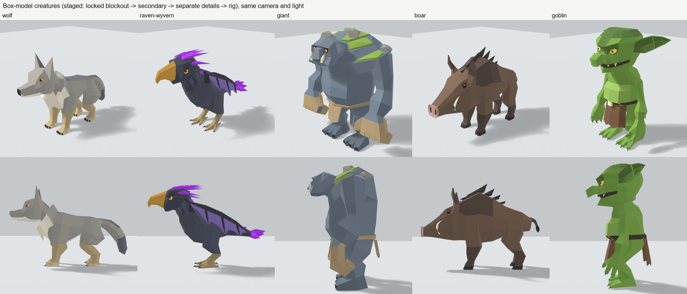
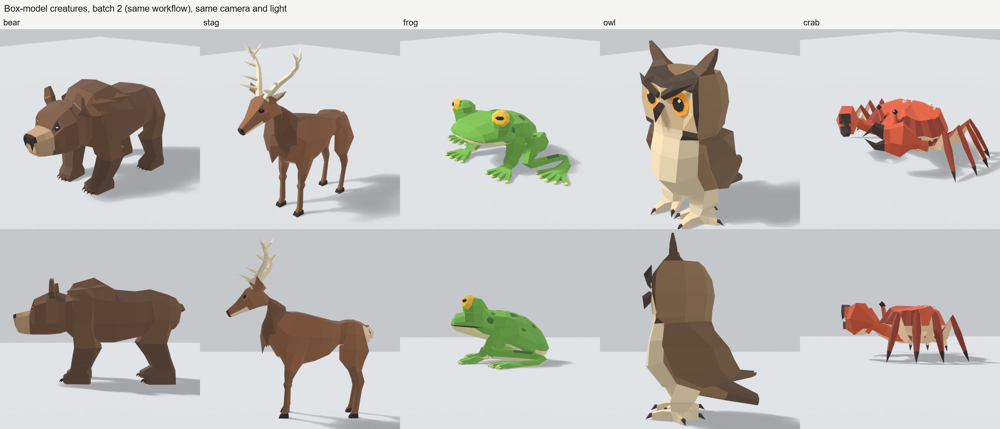
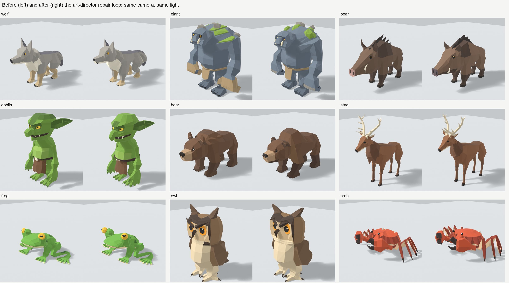
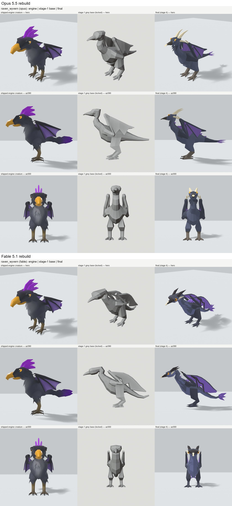
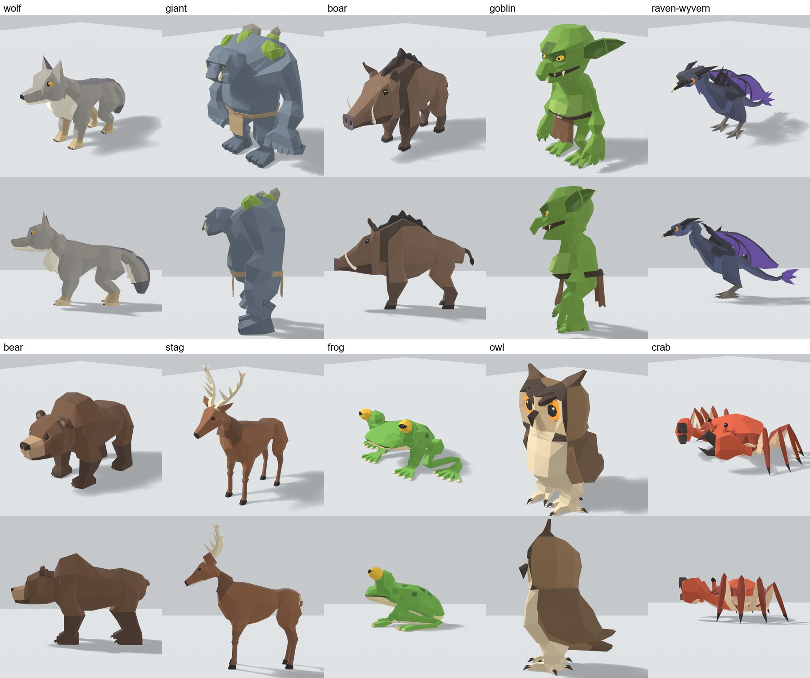
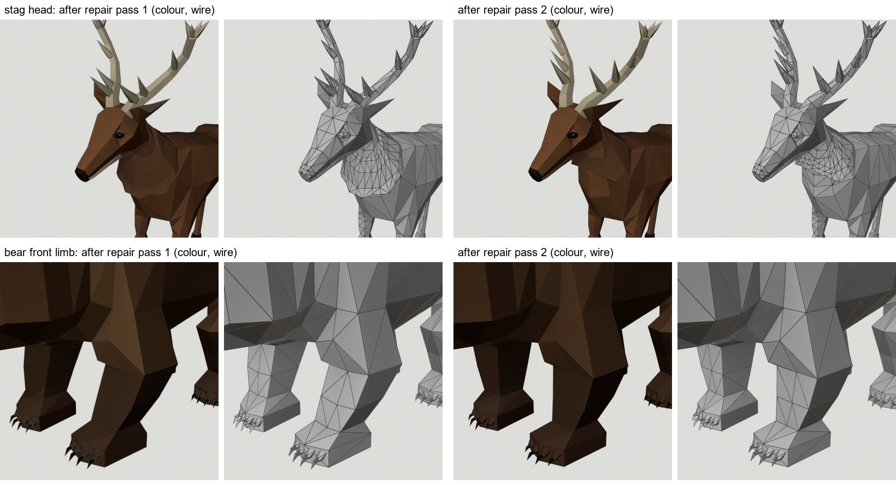
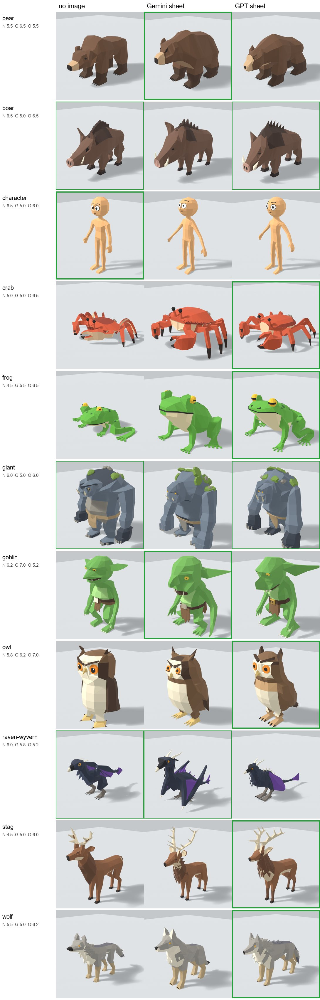

# Staged box-model run — results (2026-09-27)

Five creatures were built with the protocol in `BRIEF.md` (a follow-up to
`docs/research/NEXT_STEPS.md`):

1. a locked stage-1 blockout;
2. secondary edits whose topology changes are logged;
3. tertiary details as separate pieces;
4. the rig.

Each creature is a bpy program under `opus/<creature>/`, built by one Opus 5.5
seat through render → critique → one fix per round, with the kit in `kit/`
enforcing the stages.

Per creature: `opus/<creature>/side_by_side.jpg` (engine | stage-1 base |
final), `stage4/sheet.jpg` (posed and wire), `NOTES.md` (every round) and
`rounds/` (every round's sheet).

## Gates (read from the files, not from the builders' reports)

| creature | stage 1 tris (locked) | stage 2 | total | colours | min IoU vs s1 | s2 topo ops | rounds s1/s2/s3/s4 | lock edge hash | lock assertion @s4 | glbcheck | clips |
|---|---|---|---|---|---|---|---|---|---|---|---|
| wolf | 728 | 940 | 1,378 | 8 | 0.906 | 10 | 14/6/3/2 | `227fa6c46bc4…` | PASS | OK | idle/move/attack |
| raven-wyvern | 636 | 700 | 1,528 | 8 | 0.937 | 3 | 14/7/5/4 | `01338bad3cee…` | PASS | OK | idle/move/attack |
| giant | 912 | 944 | 1,398 | 8 | 0.958 | 2 | 11/4/4/2 | `1c74ca80c63a…` | PASS | OK | idle/move/attack |
| boar | 716 | 788 | 938 | 8 | 0.990 | 4 | 10/5/5/3 | `5585951446b8…` | PASS | OK | idle/move/attack |
| goblin | 1,134 | 1,206 | 1,542 | 8 | 0.954 | 3 | 13/6/3/4 | `fa2eaf4f89fd…` | PASS | OK | idle/move/attack |

What the lock assertion guarantees: dissolve every logged stage-2 insertion
(loops, terminators, chamfers, insets) and the base hashes back to
`stage1_lock.json`. Stage 3 changed no base vertex. Every detail (ruffs,
tusks, crests, claws, eyes, cloth) is a separate piece that borrows weights
from the body or rides one bone. That is the owner's neck rule, enforced. The
kit's self-test (`kit/selftest/`) plants three violations, and the gates catch
each one: an unlogged split, a stage-3 edit of the base, and a stage-1 edit
after the lock.

## Blind identity read (harness/identity.py rule, accepted lists written before any build finished)

One Fable 5.1 reader saw only the orbit read-set silhouettes (az000, az045,
az090, az135, az180, top). The accepted lists are in `judge/<creature>.brief.md`.

| creature | verdict | what the reader said first |
|---|---|---|
| wolf | **PASS**, rank 1 | "wolf" in all 6 views |
| boar | **PASS**, rank 1 | "wild boar" in all 6 views |
| goblin | **PASS**, rank 1 | "goblin" in all 6 views |
| giant | **PASS**, rank 2 | "golem" first, then "troll" in all 6 views |
| raven-wyvern | **FAIL** | "parrot / cockatoo"; griffin only at rank 4-5 |

A second Fable reader saw one colour hero render each. The wolf, boar and
goblin read instantly (clarity 4-5). The giant read as troll (3). The
raven-wyvern read as crow/raven (3), not as a dragon. Raw answers are in
`judge/results/`.

## Blind pairwise: "which of these two was made by a person?"

Each image put two models side by side (A | B), rendered identically: beauty
light, hero and side views, via `kit/render_glb.py`. Which side held the box
model was random per image, and a second set swapped every side. Four seats
answered: Fable 5.1 and Opus 5.5, each on both sets.

The comparisons:

- the shipped engine creatures (wolf, raven-wyvern, giant);
- CC0 hand-made Quaternius models from poly.pizza (Wolf, Giant, Goblin, and
  Pig for the boar), fetched to git-ignored `out/` for judging only.

**The box model was picked as the human-made one in 28 of 28 judgements.**

| pair | picked as human | confidences |
|---|---|---|
| wolf vs engine | 4/4 | 5 4 5 4 |
| raven-wyvern vs engine | 4/4 | 3 3 3 3 |
| giant vs engine | 4/4 | 4 4 4 4 |
| wolf vs CC0 Quaternius wolf | 4/4 | 4 3 3 2 |
| boar vs CC0 Quaternius pig | 4/4 | 4 4 3 2 |
| giant vs CC0 Quaternius giant | 4/4 | 4 4 5 5 |
| goblin vs CC0 Quaternius goblin | 4/4 | 5 5 5 5 |

**Read this with its limits:**

- **The judges are models, not people.** They reward "designed" cues: colour
  zones, eyes, clothing, claws.
- **The CC0 giant and goblin are a cube-world style**: bevelled boxes,
  T-posed, shown here at their Idle frame. The judges read that style as
  "stacked primitives", so those two wins say little about craft.
- **The fair comparisons are the faceted Quaternius wolf and pig.** The box
  model won both, but at the lowest confidences (2-4).
- **Blinding leaked.** Every subagent here receives the repo's git status and
  recent commit subjects ("staged box-model experiment …"); one judge flagged
  it.
- **Models repeat.** The same box models recur across images, so a seat could
  cross-reference.

A clean rerun needs human raters, or judge seats outside this repository, one
pair per seat.

## Weaknesses that remain (the builders' own, plus review)

- **Raven-wyvern:** fails identity; it is a crested raven with dragon pieces
  on. The folded wing is one flat panel per side, and the head is boxy.
- **Wolf:** from the front, the cream ruff, bib and jaw merge into one pale
  mass. The legs are 6-sided prisms, and the hips slide the planted feet in
  `attack`.
- **Giant:** gorilla-like from the side and back (a tall bean torso). The
  fists read more mitt than clenched from the front, and the eyes are small
  hex "googly" shapes.
- **Boar:** the flank keeps even vertical ring strips (a trace of the loft
  look), the legs are plain columns, and the crest is a row of similar spikes.
- **Goblin:** the attack wind-up stops at jaw height, the belly and skull show
  horizontal banding, and the ear cup is a groove rather than a bowl.

## Kit changes made during the run

- **`extrude()`:** a multi-face region's interior edges are now deleted with
  the region; two builders had worked around the loose wires.
- **Grey stages export with a clay material.** Without one,
  `harness/outline.py` gave the primitives material -1 and drew empty views.
- **`inset()` keeps the face's own corners**, so a stage-2 socket dissolves
  back out.
- **glbcheck runs through an import of `checkGLB`.** The CLI guard in
  `harness/glbcheck.mjs` never matches a Windows path, so the CLI silently
  exits 0 there. That is flagged as a separate task.

All five locks were re-verified after the kit changes (stage 1 reproduces each
lock exactly).

## Not done from the handoff

- **The wolf built by BOTH models (Fable vs Opus) was not run.** The owner
  asked for five creatures instead. All five were built by Opus 5.5.
- The "If it wins" steps (replace the loft engine, drop the loft-only checks,
  rewrite `cards/STYLE.md`, recalibrate the triangle budget) are owner calls
  and were not started.

# Batch 2 (2026-09-27): bear, stag, frog, owl, crab

This batch used the same workflow and the same kit, plus the §7 lessons in
`BRIEF.md`. Every stage-4 gate passes for all five: the lock assertion, full
weights, the idle/move/attack clips and glbcheck.

Triangles:

| creature | stage 1 | final |
|---|---|---|
| bear | 692 | 1,400 |
| stag | 768 | 1,576 |
| frog | 1,208 | 2,024 |
| owl | 580 | 898 |
| crab | 966 | 1,306 |

**Blind identity** (one Fable reader, silhouettes first, then colour; the
accepted lists were written before the builds): **5/5 PASS at rank 1 in all
six views.** The readers said:

- bear: "bear"
- stag: "deer"
- frog: "frog"
- owl: "owl"
- crab: "crab"

The colour reads matched, at clarity 4-5. Raw answers are in
`judge/results/identity_batch2_fable.json`.

The builders' own biggest weaknesses:

- **bear:** banded flank; pig-ish nose disc from the front.
- **stag:** the grey base reads doe or foal until the antlers are on.
- **frog:** the eye lenses sit over the socket windows; the feet are flat
  boards.
- **owl:** box-built feet; one flat panel for the wing.
- **crab:** the locked radial fan still shows in the carapace crown; the legs
  read as a comb.

Kit notes for later:

- `flatten()` across x = 0 pulls vertices off the seam.
- Bone rolls on limbs that point out and up are arbitrary; the crab set its
  own.
- Stage sheets are framed to the stage-1 box, which crops the antlers.

# Art-direction loop (2026-09-27): tech QA + Fable 5.1 / Opus 5.5 reviews

The owner found technical errors in close crops: an antler through an ear,
shard-like cape and ruff plates, and pinched folds at a shoulder. The workflow
changed in response:

- the tech-QA gate in the kit (`kit/techqa.py`, `BRIEF.md` §8);
- an art-director contract (`ART_DIRECTOR.md`);
- a review packet (`run.py --review`);
- one review → repair → re-review loop. Both models reviewed blind and in
  parallel, and the orchestrator reconciled their notes in
  `opus/<c>/review/ad_notes.md`.

Scores are Fable 5.1 / Opus 5.5, before and after one repair pass:

| creature | round 1 | round 2 | round-1 blockers left | top residual |
|---|---|---|---|---|
| wolf | 6 / 5 | 7 / 6 | none | the ruff reads as a collar ring; weak stride; stilt legs (limited by the IoU floor) |
| giant | 6 / 5 | 6 / 5 | none | pieces drift in poses; big flipped chest triangles; mitt-like knuckles |
| boar | 6 / 6 | **7 SHIP** / 7 | none | crest points; hard saddle border |
| goblin | 7 / 5 | 7 / 6 | none (new: the buckle is a thin fin) | flat belly; skull dome disputed between the reviewers |
| bear | 6 / 5 | 7 / 7 | none | the eye beads drift in the attack |
| stag | 7 / 6 | 7 / 7 | none | tines near the ears / comb-like from the front; the mane rim reads as an outline |
| frog | 5 / 5 | 7 / 6 | none | the eye is a flat nut face-on; hip fold at the limit |
| owl | 7 / 6 | 7 / 7 | none | face pieces drift in poses |
| crab | 6 / 5 | 7 / 5 | none | spider-like legs; the crown fan (locked topology); front teeth disputed |

The mean went from 5.7 to 6.6. Every tech-QA gate passed at the end of the
repair pass.

The round-2 reviews then drove two new kit gates:

- **Area-weighted fold-overs.** The giant's 4 flipped triangles were 0.21% of
  the triangles but 0.49% of the surface area, so a triangle count
  undercounts big faces.
- **Posed drift.** A piece that sits on the body at rest but comes off it in a
  pose, or slides over it: eyes rigid to the head while the face skin follows
  blended weights.

Measured drift at the time of the round-2 review:

| creature | drifting piece shells |
|---|---|
| giant | 10 |
| owl | 7 |
| goblin | 2 |
| bear | 2 |
| frog | 1 |

These are the residual for a second repair pass.

Other kit fixes found in this loop:

- The rest pose was not restored after the posed-frame QA, so the stage-4
  tech tiles looked posed.
- **Z-fighting:** now counts only same-facing coplanar faces. A hoof cap
  pressed against a leg end is a contact, not flicker.
- **Close-ups:** framed from each bone chain's extent, and aimed at the
  largest piece.
- **Stable locks:** a canonical stage-1 vertex and face order for new locks
  (`order: canonical`). bmesh's multi-face extrude ordered vertices by pointer
  hash, and the lock gate failed with no code change.

## The raven-wyvern rebuild: Fable 5.1 vs Opus 5.5

The raven-wyvern got a REBUILD verdict in round 1 because it read as a parrot.
Fable 5.1 and Opus 5.5 each rebuilt it from a new stage 1, in parallel, with
the silhouette cue in the base: an S-neck, a reptile tail and wing
forelimbs.

- Fable 5.1: `fable/raven_wyvern`
- Opus 5.5: `opus/raven_wyvern_v2`

Both rebuilds were then judged blind:

- **Identity:** one fresh Fable 5.1 reader per sheet, with no context, scored
  by `harness/identity.py`.
- **Art direction:** a Fable 5.1 seat and an Opus 5.5 seat in parallel, each
  seeing both packets labelled only "candidate A" and "candidate B".

| | old build | Opus 5.5 rebuild | **Fable 5.1 rebuild** |
|---|---|---|---|
| silhouette read | FAIL: parrot, cockatoo, eagle | PASS at rank 2: "wyvern" 2nd in az045/az090/az135 (1st was pteranodon), and in the top 3 in all 6 views | **PASS at rank 1**: wyvern or dragon 1st in az045, az090, az135 and top. az000 and az180 read as rabbit or gargoyle |
| colour read | — | "raven wyvern" 1st | "raven", then "wyvern" 2nd |
| art director (Fable / Opus) | REBUILD | REBUILD 4 / FIX 4 | **FIX 6 / FIX 6** |
| preferred by | — | neither | **both, "clear" margin** |
| tech QA | — | passed on the older kit. Under the current kit it fails drift: the horns come off the head in poses | all gates pass, drift 0 |
| triangles | — | 1896 | 2128 |

**The Fable 5.1 rebuild is the raven-wyvern from now on.**

Why both reviewers picked it:

- It reads wyvern-first: a forward-pitched crouch, a long neck, folded
  membrane wings and a spade tail.
- It has a readable eye (ring, pupil, catchlight) and a heavy raven bill.
- Its attack reads.

The Opus rebuild stands upright like a horned crow. It has orange block eyes,
cheek horns that drift off in poses, and two attack frames that barely
differ.

The reconciled residual for the pick is in
`fable/raven_wyvern/review/ad_notes.md`:

- four must-fixes, all at stages 2–3:
  - the hackles are flat chips; rebuild them as throat clumps;
  - the wing fingers are Z-kinked tubes; taper them to one bend;
  - the legs are a single near-black; separate their values;
  - the dorsal spines are a lilac comb;
- five minors;
- the tail at about 0.9 of the body length, which needs a stage-1 unlock and
  is left as a residual.

What the comparison taught the workflow:

- **Blind paths must be neutral.** The first four identity reads used sheets
  in a folder named after the creature (`raven_ab/`). One reader answered
  "raven wyvern" as a colour guess. Those reads were discarded as primed
  (`out/boxmodel/judge/raven_ab/primed_reads.json`) and rerun from
  `q0927/sheet_*.jpg`.
- **Every heatmap flag needs its own legend entry.** Drift was painted in the
  floating blue, so both reviewers reported the Opus rebuild's drifting horns
  as floating and the JSON as wrong. Drift now has its own colour (brown) and
  legend entry. The kit self-test still passes.

# Second repair pass (K=2) and review round 3 (2026-09-27)

The owner approved a second full pass on all 10 creatures. It ran in three
steps:

1. **Notes.** The orchestrator reconciled the round-2 reviews into a must-fix
   list per creature: `review/ad_notes_r2.md`, or `ad_notes.md` for the
   raven.
2. **Repair.** One Opus 5.5 builder per creature, following `REPAIR.md`.
3. **Review.** Fable 5.1 and Opus 5.5 reviewed again, blind and in parallel,
   in two batches each. The full JSON is in
   `judge/results/ad_round3_*.json`, and `ad_round3_reconciled.json` holds
   the merged verdicts.

| creature | round 2 (F/O) | round 3 (F/O) | verdict | score | what still stands between it and SHIP |
|---|---|---|---|---|---|
| bear | 7 / 7 | **SHIP 8 / SHIP 7** | **SHIP** | 7.5 | minors: forearm posts, a comb of identical claws |
| owl | 7 / 7 | **SHIP 8 / SHIP 7** | **SHIP** | 7.5 | minors: the brow plank, tufts merging in profile, a box disc |
| boar | 7 SHIP / 7 | **SHIP 7 / SHIP 7** | **SHIP** | 7.0 | minors: saddle edge, blank face (no mouth line or brow) |
| goblin | 7 / 6 | **SHIP 7 / SHIP 7** | **SHIP** | 7.0 | minors: one shoulder fold-over, the belly border, rigid flaps |
| raven-wyvern (Fable rebuild) | 6 / 6 (A/B round) | **SHIP 7 / SHIP 7** | **SHIP** | 7.0 | minors: spines bunched behind the locked wing; the wrists read as posts from the front |
| stag | 7 / 7 | SHIP 8 / FIX 7 | FIX | 7.5 | major (Opus): the tail still stands off the rump as a tab |
| frog | 7 / 6 | FIX 6 / FIX 7 | FIX | 6.5 | major (both): the hop leg stretches into a rod or neck, which the gauge misses; major (Fable, confirmed by the orchestrator): the toe pads poke out of the toe walls |
| wolf | 7 / 6 | FIX 6 / FIX 6 | FIX | 6.0 | majors: the keel wedge under the bib (both); the legs under a hem with boot paws (Opus); the ruff still a torus (Fable) |
| crab | 7 / 5 | FIX 6 / FIX 6 | FIX | 6.0 | major (both): spider legs. The IoU floor blocked the reshape (the full reshape scored 0.76) |
| giant | 6 / 5 | FIX 5 / FIX 5 | FIX | 5.0 | majors (both): mitt fists; the loincloth flaps stand off in the idle pose; nails read as slots |

**Verdicts.** Five of ten now get SHIP from both reviewers. After round 2
none did: the boar had a SHIP from one reviewer only. The mean score of the
nine original creatures barely moved, from 6.56 to 6.67:

- Round 3 saw a stricter packet. The beauty views are posed at the idle
  frame, and that exposed the giant's flaps.
- The FIX creatures' remaining notes are form problems that the IoU floor or
  the locked base stops stages 2–4 from reaching.

**Gates.** Every creature passes every tech-QA gate, read from its
`stage4/techqa.json` after the orchestrator re-ran stage 4 on the final kit
(r121):

- hit, float, z-fight and drift are 0 everywhere;
- slivers are at most 0.9%;
- posed fold-overs are at most 0.30% of triangles and 0.10% of area.

**Builders.**

- Eight of the ten hit the 60-turn `opus-worker` cap and needed one resume
  each.
- On two creatures a builder reported an item as done that both reviewers
  saw as not done: the giant's flaps and fists, and the wolf's legs. The
  giant's flaps were fixed at the rest pose, and the idle pose undoes them.

Kit changes in this pass, all found by the loop:

- **Deterministic posed QA.** On identical input the fold-over gate gave
  8 or 16 flips, PASS or FAIL. There were two causes:
  - The clips were sampled in the iteration order of a set of names, which
    changes per process because Blender's Python randomises string hashes.
  - Bones a clip does not key kept the previous clip's pose.

  Fix: sorted clip order, and each clip is sampled alone from rest
  (`techqa._zero_pose`, which `bmkit.pose()` also uses). The posed review
  renders had the same carry-over.
- **Drift** has its own heatmap colour, brown. It used to share floating's
  blue, and reviewers misread it.
- **No per-object outline in the colour and tech renders.** Workbench drew a
  dark sticker edge round every piece, and reviewers read it as glued-on.
- **Beauty views at the idle clip's first frame,** as a game shows the
  creature.

Things the reviewers still catch by eye that no gate measures yet:

- posed stretch or section loss (the frog's hop leg);
- a single-contact pass-through (the frog's toe pads, earlier the stag's
  tines by its ears);
- daylight under hanging pieces in the idle pose (the giant's flaps).

**Blocked by owner numbers or the locked base, not by effort:**

- the crab's legs: the IoU floor, or a stage-1 unlock;
- the wolf's legs: the IoU floor;
- the bear: no silhouette room left (az000 IoU 0.901);
- the raven's rear spines, which sit under the locked wing;
- the crab's crown pole: the topology is locked, though the colour now reads
  as planes.

# Third repair pass (K=3, stage-1 unlock) and review round 4 (2026-09-27)

The owner authorised a third pass on the five FIX creatures, with a stage-1
unlock for the items named in `review/ad_notes_r3.md`. The builders kept
each old lock as `stage1_lock.pre_unlock.json`. Reviews are in
`judge/results/ad_round4_*.json`.

| creature | round 3 | round 4 (F / O) | verdict | stage-1 change | open |
|---|---|---|---|---|---|
| stag | 7.5 | FIX 7 / FIX 7 | FIX, 7.0 | the tail | major (both): the rump still reads as a cup or curl with a hook tail |
| frog | 6.5 | FIX 7 / FIX 7 | FIX, 7.0 | none | major (both): at the hop extreme the near leg is a straight spike; the far leg stays folded |
| wolf | 6.0 | SHIP 7 / FIX 6 | FIX, 6.5 | keel, legs, paws | major (Opus): the paws still flare as boots; the ruff still frames the head as a collar |
| crab | 6.0 | SHIP 7 / FIX 5 | FIX, 6.0 | legs, body height | blocker (Opus): in the move clip the legs snap between straight stakes and bent legs on consecutive frames, because not every frame keys the leg IK |
| giant | 5.0 | FIX 6 / FIX 6 | FIX, 6.0 | hands, brow, jaw | major (both): the fists are still mitts, with no knuckle steps in silhouette |

**Identity after the unlock.** A blind Fable read of the five changed bases
passes for all five at rank 1 (`judge/results/identity_r4_unlocked_fable.json`):

- crab, stag and frog are read first in all six views;
- the giant reads as troll or ogre;
- the wolf is read as "fox" first in four views. It passes on "wolf" and
  "dog" in the other two.

**The loop has plateaued.** Across three repair passes the five hardest
creatures went from a mean of 6.2 to 6.5. For the third time, two creatures
had a fix reported as done that both reviewers saw as not done: the giant's
knuckles and the stag's tail. The orchestrator checked the cited views and
agreed with the reviewers. This is why the reference-image test
(`refs/PLAN.md`) is next: a better target before the build, not more passes
after it.

# Reference-image test: no image vs Gemini sheet vs GPT sheet (2026-09-28)

**The question** (the owner's): does a generated multi-view reference sheet
help the builder, and which generator's sheet helps more? The protocol is in
`refs/PLAN.md` and the sheets are described in `refs/SHEETS.md`.

**The setup.**

- 11 creatures × 3 settings = 33 fresh builds. The 11 are the ten creatures
  plus the owner's toon character.
- Everything else was the same across settings:
  - the text brief (`refs/briefs/`);
  - the builder, Opus 5.5 under `refs/BUILD.md`;
  - the kit;
  - no repair loop.
- G and O builders got the turnaround sheet plus the blueprint traced from
  it:
  - **G:** the sheet from Gemini, through the Antigravity CLI `agy`;
  - **O:** the sheet from GPT, through the Codex CLI `gpt-6-astra`.
- Both ran on the owner's subscriptions. Each sheet had its view directions
  fixed and its views fitted to agree before use.
- Judging was blind:
  - 11 Fable identity readers saw neutral silhouette sheets;
  - 8 art-director seats (4 Fable, 4 Opus) scored and ranked each
    creature's three builds, labelled only A, B and C.

| | no image (N) | Gemini sheet (G) | **GPT sheet (O)** |
|---|---|---|---|
| gates pass (33 builds, read from files) | 11/11 | 11/11 | 11/11 |
| blind identity | 10/11 (raven-wyvern read as a raptor) | 11/11 | **11/11** |
| mean art-director score (22 seat-scores) | 5.64 | 5.55 | **6.07** |
| ranked first (of 22) | 5 | 5 | **12** |
| ranked last (of 22) | 8 | 10 | **4** |
| mean rank (1 = best) | 2.14 | 2.23 | **1.64** |

Which setting each seat ranked first:

- **both seats chose the GPT sheet:** crab, frog, owl, stag, wolf;
- **both chose the Gemini sheet:** bear, goblin;
- **both chose no image:** the owner's character;
- **the seats split:** boar, giant, raven-wyvern.

**Verdict against the pre-set rule.** A setting wins when its mean beats
each other setting by at least 0.5 *and* it ranks first on at least 6 of 11
creatures in both seats. **The GPT sheet does not quite clear it:**

- its mean beats Gemini by 0.52 but no image by only 0.43;
- the Fable seats ranked it first on 5 creatures, the Opus seats on 7.

By the rule's letter the result is "no clear difference". In practice the
GPT sheet leads on every measure:

- it has the best mean, 2.4× the first places, half the last places, and
  perfect identity;
- the Gemini sheet is no better than no image.

**Caveats.**

- There is one build per creature and setting, and builder variance is
  large: the per-creature gaps are within noise, and only the aggregate means
  anything.
- The sheets pushed proportions away from the briefs. They were scaled by
  height, and bodies came out 15–45% shorter than the brief (bear, stag,
  frog, crab), because "the sheet wins on shape". **Fixed for new builds
  (2026-09-28):** `orient.py --fit --aspect` stretches the side and plan
  views to the brief's length, and traced lengths now match the briefs
  within 1% (`refs/lengthfit.jpg`).
  - GPT stretches: frog 1.29, stag 1.26, giant 1.12, raven 0.84, goblin
    0.74.
  - Gemini now loses crab, frog and stag: they exceed the 35% limit.
  - The N/G/O selection is kept in `refs/chosen_ngo.json`. The 33 builds
    keep their references: their stage 1 is locked.
- One O build (the giant) had a degenerate traced top outline.
- The no-image builds scored their own drawn blueprints, so their stage-1
  IoUs are not comparable.
- **Cost.**
  - Sheets: made on subscriptions. GPT needed 12 attempts for 10 sheets,
    Gemini 18.
  - Builds: about the same in every setting; 7 of 33 needed one resume.

**Kit bugs and gaps found by the 33 builders**, all fixed on 2026-09-28:

- `extrude()['sides']`: new faces carry index -1 and no normal, so sorting by
  index kept the per-run set order, and picking a side face by its normal
  read garbage. Fixed: `index_update()` and fresh normals, and every vertex
  verb refreshes the normals of the faces it touches.
- `bmkit.py` (`assert_lock`): the `vert_collapse_edge` arguments were swapped.
  Blender raised "argument 1 must be BMVert, not BMEdge". Fixed.
- Posed QA sampled each clip at 20/40/60/80% only. It now samples every keyed
  frame as well, up to 40 per clip. A triangle counts once, not once per
  frame.
- `refs.py`: averaging the halves left a detached one-pixel spur, and the
  plan trace started on it (the GPT giant: 2 points). It now traces the
  largest piece and omits a trace with fewer than 6 points, with a warning.
  Retracing all 22 sheets changed only the giant (2 to 23 points).
  `abc/k3/giant/blueprint.json` was retraced; side and front are unchanged.
- Posed clipping is measured now: `clip`, pink, a triangle that crosses
  another part in a pose but not at rest. It is a warning, not a gate, until
  the owner sets a limit.

**Regression sweep** (`kit/regress.py`, all 46 locked builds to stage 4,
before and after the fixes):

- No stage-1 lock changed.
- 8 builds now fail posed gates that the old sampler missed:
  - drift: k3 character and owl, t7 character, w4 character and owl, opus
    giant and stag;
  - fold-overs: k3 character (95 triangles), t7 character (90), w4 owl (66),
    all from the blink or the arm drop out of the T-pose; t7 bear by 3
    triangles.
- opus/raven_wyvern lost its fold-over FAIL: repeats no longer count.
- Clip (share of surface area): median about 1%.
  - Worst: opus giant 16%, opus goblin 14%, fable raven 13%, w4 giant and
    goblin 10%, opus frog 10%.
  - Checked on the heatmaps: arms swinging through the flanks, a hand
    through the face, hind legs through each other. These are real.

**Owner's verdict (2026-09-28, by eye on `refs/ngo_gallery.jpg`):** the
GPT-sheet builds are better on every creature except the boar and the bear.
This settles the "no clear difference" result above. **The GPT turnaround
sheet (Codex) is the adopted reference for box-model builds.**

## K=1 repair pass on the GPT-sheet (k3) builds (2026-09-28)

**Setup.**

- A Fable 5.1 seat reconciled the two blind N/G/O reviews of each k3
  build, plus its failures on the fixed kit, into
  `abc/k3/<c>/review/ad_notes.md`. Stage 1 stayed locked.
- 11 Opus 5.5 builders repaired one creature each under `REPAIR.md`, in parallel.
- The packets from before the repair are in `out/boxmodel/k3_pre_repair/`.
- **Gates:** all 11 pass. `kit/regress.py` agrees independently.

**Blind re-review.** Fable and Opus each judged the before and after packets
(1_beauty, 2_closeups, 4_posed), with the order shuffled per creature.
The key is in `out/boxmodel/judge/k3r_key.json`. Results are in
`judge/results/ad_k3repair_*.json`, and the before/after gallery is
`k3_repair.jpg`.

| creature | before F/O | after F/O | better (F/O) | clip % before → after |
|---|---|---|---|---|
| bear | 6/6 | 7/6 | after/after | 0 → 0 |
| boar | 5/5 | 7/6 | after/after | 0 → 0 |
| character | 6/6 | 6/5 | **before/before** | 0 → 0 |
| crab | 6/4 | 7/5 | after/after | 0.04 → 0.03 |
| frog | 6/5 | 7/6 | after/after | 4.32 → 0.91 |
| giant | 5/5 | 7/6 | after/after | 2.46 → 0.29 |
| goblin | 6/5 | 7/6 | after/after | 0.66 → 0 |
| owl | 6/5 | 7/6 | after/after | 1.00 → 0 |
| raven_wyvern | 5/5 | 7/6 | after/after | 3.56 → 0.08 |
| stag | 6/5 | 7/6 | after/after | 1.17 → 0.10 |
| wolf | 5/5 | 7/6 | after/after | 0.79 → 0 |

- **Scores:** the mean went from 5.36 to 6.36. The repaired build was
  preferred in 20 of 22 calls, and no build reached SHIP.
- **Clipping:** the new clip warning worked as a repair target. Every build
  above 1% dropped below 1%.
- **The character regressed.**
  - The new blink design (a separate lens and pupil, squashed vertically)
    passes drift.
  - But the hands throw needle slivers in every posed frame. The builder
    reported them, and Opus saw them in every frame.
  - The eye ring also reads heavier than the brief.
  - **Follow-up:** the needles were a render artifact, not geometry. The
    wire overlay's Wireframe modifier used even offset, which mitres sharp
    corners into spikes. No triangle in the exported GLB is a needle, and
    none stretches 2× in any pose. The overlay no longer uses even offset.
    The character's packet was re-rendered (r19), and it is clean.
  - A posed stretch measure was added anyway, as a warning (teal): a
    triangle whose longest edge grows past 2× its rest length. It fires on
    8 of 46 builds, mostly frogs, whose tongue lash and leg extension
    stretch by design, so it stays a warning.
- **Residual for the owner (K=1 spent):** character hands and eye ring. The
  per-creature top issues are in the review JSONs.
